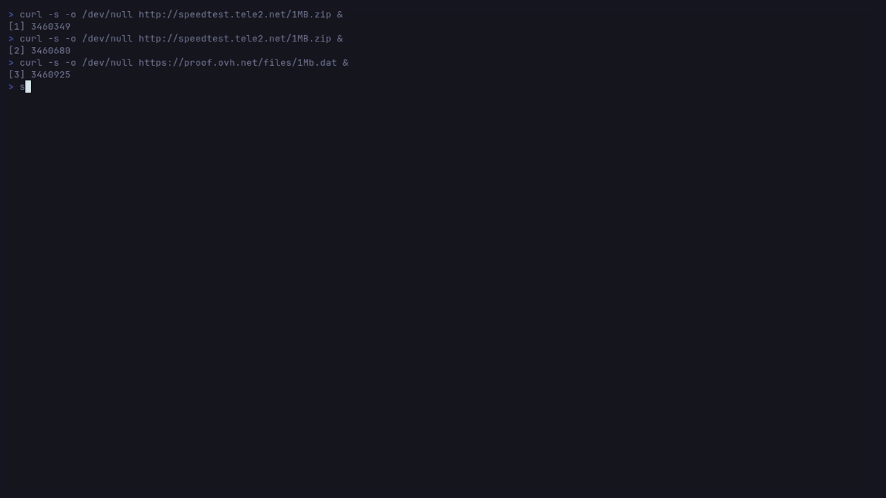
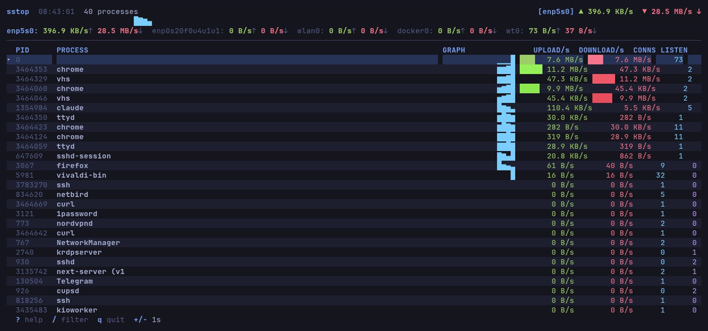
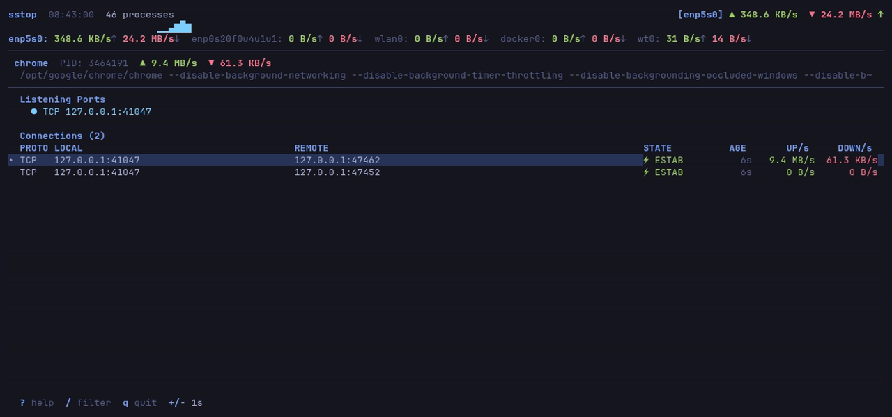
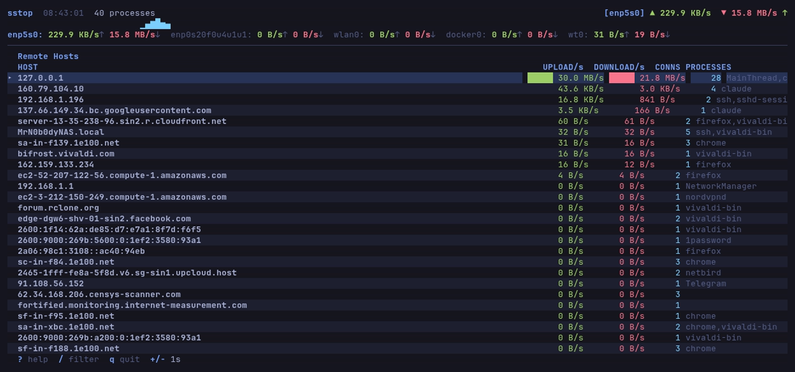
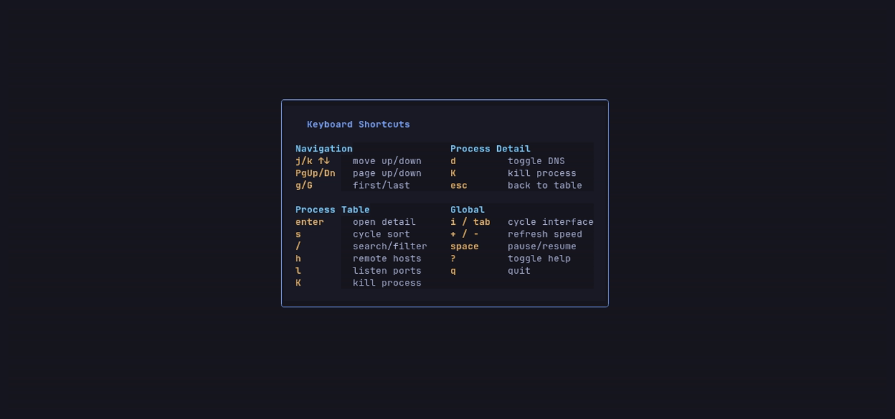

# sstop

Real-time, per-process network bandwidth monitor for the terminal. Think `htop` for network activity.



## Features

- **Per-process bandwidth tracking** with live upload/download rates
- **Sparkline graphs** showing bandwidth history per process
- **Bandwidth bars** with color intensity proportional to traffic volume
- **4 views**: Process Table, Process Detail, Remote Hosts, Listen Ports
- **Connection details** with TCP state badges, connection age, DNS resolution
- **Remote hosts aggregation** — see which hosts consume the most bandwidth across all processes
- **System-wide sparkline** in header showing total bandwidth trend over 60 seconds
- **Trend arrows** (↑↓→) indicating if traffic is rising, falling, or stable
- **Per-interface stats** with interface switching
- **Search/filter** processes by name, command, or PID
- **6 sort modes**: rate, download, upload, PID, name, connections
- **Kill process** overlay with signal selection (SIGTERM, SIGKILL, etc.)
- **Help overlay** with all keybindings
- **Mouse support** — click to select, scroll wheel to navigate
- **Dynamic refresh interval** — 100ms to 10s, adjustable at runtime
- **Pause/resume** — freeze the display while data keeps collecting
- **Tokyo Night** color theme with zebra striping
- **Cross-platform**: Linux (netlink + AF_PACKET) and macOS (netstat + lsof)

## Screenshots

<table>
<tr>
<td></td>
<td></td>
</tr>
<tr>
<td align="center"><em>Process Table</em></td>
<td align="center"><em>Process Detail</em></td>
</tr>
<tr>
<td></td>
<td></td>
</tr>
<tr>
<td align="center"><em>Remote Hosts</em></td>
<td align="center"><em>Help Overlay</em></td>
</tr>
</table>

## Installation

### From releases

Download the latest binary from [Releases](https://github.com/googlesky/sstop/releases):

```bash
# Linux amd64
curl -L https://github.com/googlesky/sstop/releases/latest/download/sstop-linux-amd64.tar.gz | tar xz
sudo mv sstop /usr/local/bin/

# Linux arm64
curl -L https://github.com/googlesky/sstop/releases/latest/download/sstop-linux-arm64.tar.gz | tar xz
sudo mv sstop /usr/local/bin/

# macOS arm64 (Apple Silicon)
curl -L https://github.com/googlesky/sstop/releases/latest/download/sstop-darwin-arm64.tar.gz | tar xz
sudo mv sstop /usr/local/bin/

# macOS amd64
curl -L https://github.com/googlesky/sstop/releases/latest/download/sstop-darwin-amd64.tar.gz | tar xz
sudo mv sstop /usr/local/bin/
```

### From source

Requires Go 1.21+:

```bash
go install github.com/googlesky/sstop@latest
```

Or build manually:

```bash
git clone https://github.com/googlesky/sstop.git
cd sstop
go build -o sstop .
```

## Usage

```bash
# Linux — requires root or CAP_NET_RAW for full bandwidth tracking
sudo sstop

# macOS — requires root for netstat/lsof process mapping
sudo sstop

# Or grant capability instead of running as root (Linux)
sudo setcap cap_net_raw+ep ./sstop
./sstop
```

## Keybindings

### Navigation

| Key | Action |
|-----|--------|
| `j` / `↓` | Move down |
| `k` / `↑` | Move up |
| `PgUp` / `Ctrl+U` | Page up |
| `PgDown` / `Ctrl+D` | Page down |
| `g` / `Home` | Jump to top |
| `G` / `End` | Jump to bottom |

### Process Table

| Key | Action |
|-----|--------|
| `Enter` | Open process detail |
| `s` | Cycle sort column |
| `/` | Search/filter |
| `h` | Remote Hosts view |
| `l` | Listen Ports view |
| `K` | Kill process |

### Process Detail

| Key | Action |
|-----|--------|
| `d` | Toggle DNS hostnames |
| `K` | Kill process |
| `Esc` | Back to table |

### Global

| Key | Action |
|-----|--------|
| `i` / `Tab` | Cycle interface |
| `+` / `=` | Faster refresh |
| `-` | Slower refresh |
| `Space` | Pause/resume |
| `?` | Help overlay |
| `q` / `Ctrl+C` | Quit |

## How It Works

### Linux

sstop uses a tiered approach for maximum compatibility:

1. **Netlink SOCK_DIAG** (preferred) — queries the kernel directly for all TCP/UDP sockets with per-connection byte counters from `tcp_info`. Fastest and most accurate.

2. **`/proc/net` + AF_PACKET** (fallback) — when the `inet_diag` kernel module is unavailable (common on minimal/custom kernels), sstop falls back to parsing `/proc/net/{tcp,tcp6,udp,udp6}` for socket enumeration and opens an AF_PACKET raw socket to track per-connection bandwidth at the packet level.

Process-to-socket mapping is done by scanning `/proc/<pid>/fd/` for socket inodes. Interface stats come from `/proc/net/dev`.

### macOS

Uses `netstat -anb` for sockets with byte counters, `lsof` for process mapping, and `netstat -ibn` for interface stats.

### Rate Smoothing

All rates use Exponential Moving Average (alpha=0.3) to provide smooth, readable values without jitter.

## Requirements

- **Linux**: root or `CAP_NET_RAW` capability. Works best with `inet_diag` kernel module loaded (`modprobe tcp_diag`).
- **macOS**: root for process-to-socket mapping via `lsof`.
- **Terminal**: 256-color support recommended. Works in any terminal that supports alternate screen.

## License

MIT
